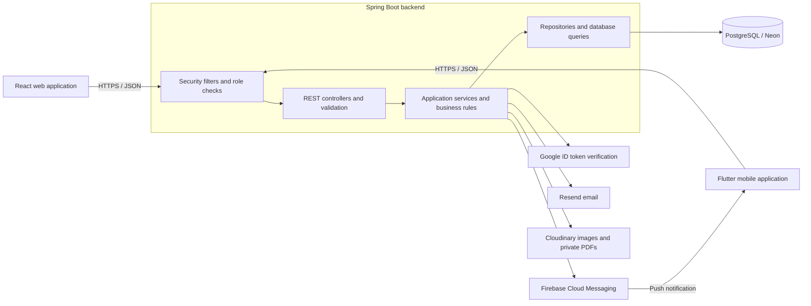
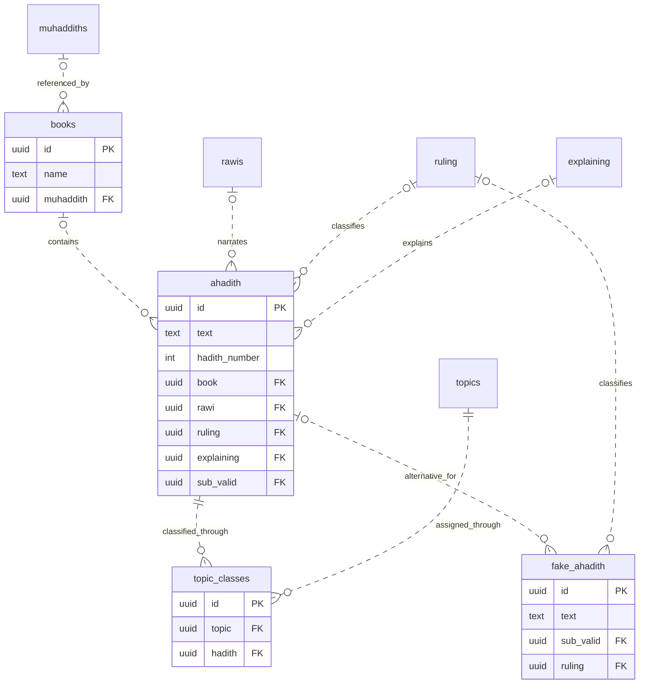
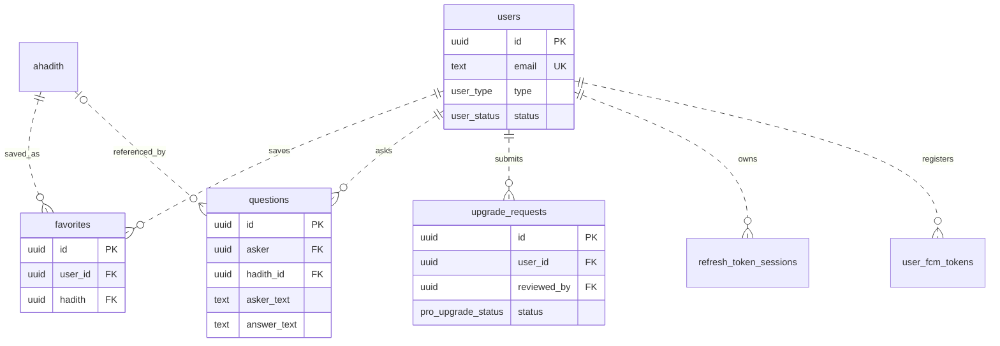

# Ahadith API | الموسوعة الحديثية

**A Spring Boot backend for a Hadith encyclopedia serving web and mobile applications.**

A fourth-year university team project that brings Hadith texts, sources, narrators, scholarly rulings, explanations, and user interactions into one connected platform.

This repository contains the backend application, its database migrations, automated tests, and development configuration.

**Backend development:** Jamil Helal

[Overview](#project-overview) · [My contribution](#my-contribution) · [Architecture](#architecture) · [Database](#database-design) · [Demo](#demo) · [Technical decisions](#technical-decisions) · [Limitations](#known-limitations)

[Tech stack](#tech-stack) · [Local setup](#run-locally) · [Tests](#tests) · [API reference](#api-v1) · [Migrations](#migrations)

> **Branch scope**
>
> The setup instructions and database diagrams in this README describe `main`.
>
> Semantic and hybrid search have a separate implementation on [`feat/semantic`](https://github.com/jamilhelal37/Ahadith-spring/tree/feat/semantic). These modes require that branch's embedding service, database migration, and configuration. They are not included in the `main` runtime documented here.

---

## Project overview

### The problem

A Hadith text shared without its source, narrator, scholarly ruling, or explanation loses important context. Users also need a clear way to distinguish documented material from widely circulated texts that are not authentic.

Ahadith addresses this information-organization problem through a searchable encyclopedia with connected reference data and role-based content management.

The application stores and presents documented information. It does not independently determine the religious authenticity of a Hadith.

### The platform

The project consists of three connected components:

| Component | Responsibility |
| --- | --- |
| React web application | Browser-based access to the encyclopedia and administration interfaces. |
| Flutter mobile application | Mobile access to content, account features, and notifications. |
| Spring Boot backend | Shared API, authentication, authorization, business rules, database access, and external integrations. |

Both clients use the same backend and database, keeping account behavior, permissions, and content operations consistent.

### Main backend capabilities

| Area | Capabilities |
| --- | --- |
| Hadith catalog | Hadith records, books, narrators, muhaddiths, rulings, explanations, topics, and related records. |
| Search | Normalized phrase matching, PostgreSQL full-text search, filtering, pagination, and authenticated search history. |
| Authentication | Email/password login, email verification, password reset, Google ID token login, JWT access tokens, and refresh sessions. |
| User features | Profile management, password changes, favorites, comments, and questions. |
| Scholar workflows | Scholar-upgrade requests, document submission, and administrative review. |
| Administration | Content management, user search, account activation/deactivation, and role management. |
| Notifications | Firebase Cloud Messaging integration, including notifications for newly added non-authentic circulated texts. |
| Operations | Database migrations, activity logging, scheduled security-data cleanup, health endpoints, and test configuration. |

### Semantic search extension

The separate `feat/semantic` branch extends the search system with:

- `SEMANTIC`: BGE-M3 embeddings and pgvector cosine similarity.
- `HYBRID`: full-text and semantic candidate rankings combined through Reciprocal Rank Fusion.
- Administrative embedding backfill and status endpoints.
- Text-search fallback in hybrid mode when the embedding service is unavailable.

See the [semantic search documentation](https://github.com/jamilhelal37/Ahadith-spring/blob/feat/semantic/README.md#hadith-search) for setup and branch-specific behavior.

---

## My contribution

I am **Jamil Helal**, responsible for **backend development** in this team project.

My work focuses on the Spring Boot API and the server-side behavior shared by the web and mobile applications:

- Designing and implementing API contracts and business logic.
- Working on relational database integration and versioned migrations.
- Implementing authentication, authorization, and account workflows.
- Supporting catalog management, search, and administrative operations.
- Integrating backend services with the web and mobile clients.
- Maintaining backend configuration, tests, and deployment-related setup.

The React and Flutter applications are separate team deliverables. This description identifies my backend responsibility without claiming sole authorship of the complete platform.

### Explore the implementation

| Area | Location |
| --- | --- |
| Application source | [`src/main/java/com/jamil/ahadith`](src/main/java/com/jamil/ahadith) |
| Feature modules | [`src/main/java/com/jamil/ahadith/features`](src/main/java/com/jamil/ahadith/features) |
| Shared infrastructure | [`src/main/java/com/jamil/ahadith/core`](src/main/java/com/jamil/ahadith/core) |
| Database migrations | [`src/main/resources/db/migration`](src/main/resources/db/migration) |
| Tests | [`src/test`](src/test) |
| Application configuration | [`src/main/resources/application.yml`](src/main/resources/application.yml) |

### Related repositories

| Component | Repository |
| --- | --- |
| Spring Boot backend | [Ahadith-spring](https://github.com/jamilhelal37/Ahadith-spring) |
| React web application | [ahadithReact](https://github.com/kassemyahia/ahadithReact) |
| Flutter mobile application | [Hadith mobile application](https://github.com/HaniHankoul/newer_version_of_hadith_app) |

---

## Architecture

The core backend is a **single Spring Boot application organized by feature**, with shared security, configuration, and infrastructure code.

Controllers handle HTTP requests, services implement business rules, and repositories manage database operations. Request and response DTOs separate the public API contract from persistence entities.

### System architecture



### Typical request flow

1. A web or mobile client sends a request to the API.
2. Security filters determine whether the route is public or requires an authenticated user.
3. Authorization rules check the required role.
4. The controller validates the request and passes it to the appropriate service.
5. The service applies business rules and performs database operations through repositories.
6. The backend returns a response DTO or a consistent error response.

### Transaction-aware notifications

When a non-authentic circulated text is created, the associated FCM listener runs **after the database transaction commits**.

This prevents the application from sending a creation notification for a record that was rolled back.

The notification payload contains `fakeHadithId`, allowing a client to navigate to the corresponding detail screen.

Delivery requires configured Firebase credentials, valid device tokens, and client-side notification handling.

Implementation:

- [Transaction event listener](src/main/java/com/jamil/ahadith/features/hadith/service/FakeHadithCreatedFcmNotificationListener.java)
- [Notification sender service](src/main/java/com/jamil/ahadith/features/hadith/service/FakeHadithCreatedFcmNotificationService.java)

### Deployment and local development

The project includes configuration for a hosted PostgreSQL database on Neon and documents Render-specific proxy settings.

For local development, the application can connect to Neon using environment configuration. Docker Compose also provides an explicitly selected local PostgreSQL stack.

These are different database paths. Starting a local container should not be confused with connecting to the hosted database.

The semantic-search branch adds a Python embedding service and a separate pgvector-backed table. Those components are not included in the `main` architecture diagram above.

---

## Database design

The schema separates reference content, user interactions, and account/security records.

The diagrams below are simplified views of `main`. They intentionally omit some columns and relationships to keep the main data model readable.

The [Flyway migrations](src/main/resources/db/migration) remain the authoritative schema definition.

### Content relationships



The optional parent markers reflect nullable foreign keys in the actual schema. For example, a Hadith record can exist without a linked book, narrator, ruling, or explanation.

`fake_ahadith.sub_valid` optionally points to an alternative record in `ahadith`; it does not represent a one-to-one relationship.

### User and workflow relationships



The reviewer relationship, audit fields, and supporting account-token tables are omitted from this diagram for readability.

### Main table groups

| Tables | Responsibility |
| --- | --- |
| `ahadith`, `books`, `rawis`, `muhaddiths`, `ruling`, `explaining` | Hadith content and its bibliographic, narrator, ruling, and explanatory records. |
| `topics`, `topic_classes` | Topic definitions and many-to-many Hadith classification. |
| `fake_ahadith`, `similar_ahadith` | Non-authentic circulated texts and explicit links between Hadith records. |
| `users`, `favorites`, `comments`, `questions`, `search_history` | Accounts and user interactions. |
| `upgrade_requests` | Scholar-upgrade submissions, document metadata, and review decisions. |
| `refresh_token_sessions`, `email_verification_tokens`, `password_reset_tokens`, `login_attempts` | Session lifecycle, account verification/recovery, and login-attempt tracking. |
| `notifications`, `user_fcm_tokens` | Stored notification records and registered device tokens. |
| `activity_log` | Actor information, affected records, and change data for audit use. |

### Important integrity rules

**Hadith numbering**

The schema requires a positive Hadith number and defines a unique `(book, hadith_number)` pair.

Because `book` is nullable, this composite constraint is not a global uniqueness guarantee for records without a book.

**Duplicate relationships**

Unique pair constraints prevent duplicate favorites and duplicate assignments of the same topic to the same Hadith.

**Scholar-upgrade requests**

A partial unique index permits only one open upgrade request per user while retaining completed request history.

**FCM token ownership**

Migration `V11` adds global FCM token uniqueness, rather than relying only on a `(user_id, fcm_token)` pair.

**Deletion behavior**

Many catalog relationships use `ON DELETE SET NULL`, preserving the referencing record when its related catalog record is deleted.

Dependent interaction records, such as favorites, use cascading deletion where defined in the schema.

**Search representations**

`ahadith.search_vector` is a PostgreSQL `tsvector` used for full-text search.

It is not an AI embedding.

Likewise, `similar_ahadith` stores explicit links between records rather than a semantic vector index. The semantic branch introduces a separate `hadith_embeddings` table.

---

## Demo

### Web application

[Open the Ahadith web demo](https://locallost.me/ahadithReact/)

This is the web address configured for the project. Availability and supported features depend on the deployed frontend and backend versions.

### Suggested walkthrough

1. Browse a book and open a Hadith.
2. Inspect its linked source, narrator, ruling, and explanation.
3. Search for a phrase and apply a catalog filter.
4. Sign in with an authorized member account to explore favorites and questions.
5. Use an authorized administrator account to demonstrate content management or scholar-upgrade review.

Demonstrate semantic and hybrid search only on a deployment that includes the semantic implementation, its embedding service, and populated embeddings.

Do not publish real administrator credentials or access tokens in the repository.

### Screenshots and video

A curated screenshot gallery and recorded walkthrough have not been added to this README yet.

Recommended captures include the catalog, search results, Hadith details, and administrative workflows.

<!--
Add approved screenshots here after committing the actual image files.
Use repository-relative paths.
Remove personal data, credentials, and access tokens before publishing.
-->

---

## Technical decisions

The following decisions describe choices visible in the implementation and their trade-offs.

### 1. A shared backend for web and mobile

**Problem:** Both clients need consistent authentication, permissions, and business rules.

**Choice:** A shared Spring Boot API with server-side validation and authorization.

**Trade-off:** Clients avoid duplicating core rules, but both depend on the availability and compatibility of the same backend.

### 2. Relational data modeling with versioned migrations

**Problem:** Hadith records reference reusable books, narrators, rulings, explanations, and topics.

**Choice:** PostgreSQL tables, foreign keys, join tables, and Flyway migrations.

**Trade-off:** Relationships and integrity rules are explicit, but schema changes must remain compatible across development and deployment environments.

### 3. Separate original text from searchable representations

**Problem:** Arabic text needs search preparation without replacing the original displayed content.

**Choice:** Separate original/search fields, PostgreSQL full-text search, and trigram indexes.

**Trade-off:** Search preparation stays separate from the source text. Search quality still depends on normalization, query behavior, and the quality of the underlying data.

### 4. Revocable token-based authentication

**Problem:** A user session may need to become invalid before an access token naturally expires.

**Choice:** JWT access tokens, hashed refresh-session records, refresh-token rotation, and a user `tokenVersion`.

**Trade-off:** Sensitive account changes can invalidate existing sessions, while the application retains server-side session state and associated lifecycle management.

### 5. Restricted document access

**Problem:** Scholar-upgrade documents should not become publicly accessible uploads.

**Choice:** Backend PDF validation, authenticated Cloudinary storage, and short-lived document links returned through authorized endpoints.

**Trade-off:** Access is controlled before link creation, while provider configuration and document-link lifetime remain operational responsibilities.

### 6. Notifications after transaction commit

**Problem:** A notification should not announce a record that failed to persist.

**Choice:** Send the creation notification through an after-commit transaction listener.

**Trade-off:** The record exists before sending, but the listener itself is not a durable retry queue.

### Semantic-search extension

The semantic branch separates model inference into a Python embedding service and stores vectors in PostgreSQL using pgvector.

Its hybrid search combines text and semantic candidate rankings through Reciprocal Rank Fusion, with text-search fallback when the embedding service is unavailable.

This introduces another runtime dependency and requires embedding generation, model configuration, and ongoing index maintenance.

See the [feature-branch search documentation](https://github.com/jamilhelal37/Ahadith-spring/blob/feat/semantic/README.md#hadith-search).

---

## Known limitations

| Area | Current boundary |
| --- | --- |
| Content quality | Bundled seed data is for development and demonstration, not a final or authoritative religious reference. Production content requires reviewed sourcing and validation. |
| Branch-specific search | Semantic and hybrid search are implemented on `feat/semantic`, not in the `main` runtime documented here. |
| Notification delivery | The after-commit listener logs sending failures but does not itself persist a durable retry job. |
| Question answers | The current `questions` table stores one `answer_text` field rather than a separate collection of answers from multiple scholars. |
| External integrations | Google login, email, media storage, and push notifications depend on valid provider configuration. |
| API compatibility | Some legacy route aliases remain temporarily. New clients should use `/api/v1`. |
| Presentation and evaluation | A curated screenshot gallery and walkthrough video remain documentation improvements. This README does not claim benchmark results or a measured test-coverage percentage. |

---

## Tech Stack

| Area | Technology |
| --- | --- |
| Language | Java 21 |
| Backend framework | Spring Boot 4.1.0 |
| Security | Spring Security and JWT |
| Persistence | Spring Data JPA / Hibernate |
| Database | PostgreSQL 16 |
| Database migrations | Flyway |
| Build tooling | Maven Wrapper |
| Media storage | Cloudinary |
| Email | Resend |
| Push notifications | Firebase Cloud Messaging |
| Containers | Docker / Docker Compose |

The semantic branch additionally uses pgvector and a Python embedding service.

## Requirements

- Java 21.
- Docker and Docker Compose for the full `verify` suite and the optional local database.
- A Neon PostgreSQL database for the normal development workflow.
- Provider configuration for the external integrations being enabled.

## Environment Variables

Use `.env.example` as the local template and configure the Neon JDBC URL and credentials in `.env`.

The JDBC URL should enable TLS with `sslmode=require`.

Do not commit real `.env` files, production secrets, private service-account keys, API keys, or tokens.

Production configuration includes the following variables. Which integration-specific values are needed depends on the features being enabled:

```text
SPRING_PROFILES_ACTIVE
SPRING_DATASOURCE_URL
SPRING_DATASOURCE_USERNAME
SPRING_DATASOURCE_PASSWORD
PORT

JWT_SECRET
JWT_ACCESS_EXPIRATION
JWT_REFRESH_EXPIRATION

APP_MAIL_ENABLED
APP_MAIL_PROVIDER
RESEND_API_KEY
APP_MAIL_FROM
APP_MAIL_FRONTEND_BASE_URL

CLOUDINARY_CLOUD_NAME
CLOUDINARY_API_KEY
CLOUDINARY_API_SECRET

APP_CORS_ALLOWED_ORIGINS
APP_CORS_ALLOW_CREDENTIALS
APP_CORS_MAX_AGE
APP_SECURITY_TRUSTED_PROXY_HEADERS

APP_GOOGLE_AUTH_ENABLED
GOOGLE_AUTH_CLIENT_IDS

APP_UPGRADE_DOCUMENT_MAX_SIZE
APP_UPGRADE_DOCUMENT_MAX_PAGES
APP_UPGRADE_DOCUMENT_DOWNLOAD_TTL

APP_RATE_LIMIT_UPGRADE_REQUEST_CREATE_CAPACITY
APP_RATE_LIMIT_UPGRADE_REQUEST_CREATE_WINDOW
```

Generate a strong local JWT secret with at least 64 random characters:

```bash
openssl rand -base64 64
```

Refer to [`.env.example`](.env.example) and the [application configuration](src/main/resources/application.yml) when configuring additional integration settings.

## Run Locally

Clone the repository:

```bash
git clone https://github.com/jamilhelal37/Ahadith-spring.git
cd Ahadith-spring
```

For a fresh clone, create `.env` from `.env.example`, then replace the example settings with your development configuration.

Linux or macOS:

```bash
cp .env.example .env
```

Windows PowerShell:

```powershell
Copy-Item .env.example .env
```

Do not overwrite an existing configured `.env` file.

### Normal development workflow

The normal local workflow connects to the Neon datasource configured in `.env`; it does not start Docker PostgreSQL.

Linux or macOS:

```bash
./mvnw spring-boot:run
```

Windows PowerShell:

```powershell
.\mvnw.cmd spring-boot:run
```

`./start-local.sh` also provides Neon-first startup with configuration checks and automatic local port selection. It does not replace the datasource configured in `.env`.

`start-neon.ps1` is available on Windows and uses the same `SPRING_DATASOURCE_*` variables without starting Docker.

### Optional local PostgreSQL

To explicitly start the local PostgreSQL service:

```bash
docker compose up -d postgres
```

The Compose `app` service is an explicit all-local stack and connects to that PostgreSQL service.

It is separate from the normal Neon workflow. Starting the database container alone does not change the datasource of an application launched separately through Maven.

## Tests

Run the fast tests:

```bash
./mvnw test
```

Run the full suite with PostgreSQL Testcontainers:

```bash
./mvnw verify
```

Windows PowerShell equivalents:

```powershell
.\mvnw.cmd test
.\mvnw.cmd verify
```

Docker must be running for integration tests named `*IT.java`. They are not skipped automatically when Docker is unavailable.

These commands describe how to run the suite; they do not imply that every test passes in every environment.

## Build

Build the application:

```bash
./mvnw clean package
```

Windows PowerShell:

```powershell
.\mvnw.cmd clean package
```

Build the Docker image:

```bash
docker build -t ahadith:local .
```

---

## API v1

The canonical API base path is:

```text
/api/v1
```

Legacy aliases remain temporarily only where controllers still expose them.

| Legacy alias | Canonical endpoint | Status |
| --- | --- | --- |
| `/auth/**` | `/api/v1/auth/**` | Deprecated alias |
| `/ahadith/**` | `/api/v1/ahadith/**` | Deprecated alias |
| `/books/**` | `/api/v1/books/**` | Deprecated alias |
| `/rawis/**` | `/api/v1/rawis/**` | Deprecated alias |
| `/rulings/**` | `/api/v1/rulings/**` | Deprecated alias |
| `/topics/**` | `/api/v1/topics/**` | Deprecated alias |
| `/muhaddiths/**` | `/api/v1/muhaddiths/**` | Deprecated alias |
| `/filterslist` | `/api/v1/search/filters` | Deprecated alias |
| `/ahadith/search/filters` | `/api/v1/search/filters` | Deprecated alias |
| `/me/**` | `/api/v1/me/**` | Deprecated alias |
| `/me/search-history/**` | `/api/v1/me/search-history/**` | Deprecated alias |
| `/scholar/**` | `/api/v1/scholar/**` | Deprecated alias |
| `/admin/**` | `/api/v1/admin/**` | Deprecated alias |

Removed search-engine aliases:

```text
GET /search
GET /me/search
GET /api/v1/search
GET /api/v1/me/search
```

## Authentication

Email/password login:

```http
POST /api/v1/auth/login
```

Google login:

```http
POST /api/v1/auth/google
```

Request:

```json
{
  "idToken": "GOOGLE_ID_TOKEN"
}
```

The client sends only a Google ID token.

The backend verifies the token with Google, links or creates the local user, and returns the same project JWT response shape used by email/password login:

```json
{
  "accessToken": "...",
  "refreshToken": "...",
  "tokenType": "Bearer",
  "expiresIn": 3600,
  "user": {}
}
```

Configure Google login with:

```text
APP_GOOGLE_AUTH_ENABLED=false
GOOGLE_AUTH_CLIENT_IDS=
```

`GOOGLE_AUTH_CLIENT_IDS` is a comma-separated allowlist of accepted Google OAuth client IDs.

Use the Google Web Client ID as the primary audience. No client secret is required or used for direct ID token verification.

## Public Catalog Examples

Public rawi and muhaddith list items contain only `serialNumber`, `name`, and `about`:

```json
{
  "serialNumber": 1,
  "name": "الإمام البخاري",
  "about": "نبذة عن المحدث"
}
```

Books use nested references:

```json
{
  "id": "33333333-3333-3333-3333-333333333333",
  "name": "صحيح البخاري",
  "muhaddith": {
    "id": "11111111-1111-1111-1111-111111111111",
    "name": "الإمام البخاري"
  }
}
```

## Hadith Search

Search endpoint on `main`:

```http
POST /api/v1/ahadith/search
```

Example request:

```json
{
  "query": "النية",
  "mode": "FLEXIBLE",
  "includeExplanation": true,
  "bookIds": [
    "33333333-3333-3333-3333-333333333333"
  ],
  "page": 0,
  "size": 20,
  "sort": "RELEVANCE"
}
```

Replace example IDs with IDs from the database being queried.

Search runs in PostgreSQL.

Authenticated users get one compatible `search_history` entry; anonymous users do not create history.

| Mode | Behavior on `main` |
| --- | --- |
| `EXACT` | Normalized phrase matching. Explanation text can be included with `includeExplanation=true`. |
| `FLEXIBLE` | Full-text search of Hadith text. `includeExplanation` does not expand this mode into explanations. |

For `SEMANTIC` and `HYBRID`, follow the [semantic branch documentation](https://github.com/jamilhelal37/Ahadith-spring/blob/feat/semantic/README.md#hadith-search).

### Search history

```http
GET    /api/v1/me/search-history
GET    /api/v1/me/search-history/search?keyword=...
DELETE /api/v1/me/search-history
DELETE /api/v1/me/search-history/{id}
```

## Admin APIs

Create responses use canonical `Location` headers under `/api/v1/admin/**`.

### Delete a book

```http
DELETE /api/v1/admin/books/{id}
```

Successful deletion returns `204`. A missing book returns `404`.

### Update a Hadith

```http
PUT /api/v1/admin/ahadith/{id}
```

Relationship fields use nested reference objects:

```json
{
  "book": {
    "id": "00000000-0000-0000-0000-000000000000"
  },
  "rawi": {
    "id": "00000000-0000-0000-0000-000000000000"
  },
  "ruling": {
    "id": "00000000-0000-0000-0000-000000000000"
  },
  "explaining": {
    "id": "00000000-0000-0000-0000-000000000000"
  },
  "subValid": {
    "id": "00000000-0000-0000-0000-000000000000"
  }
}
```

Use existing related-record IDs rather than the placeholder UUIDs above.

`PUT /api/v1/admin/ahadith/{id}` uses update DTO semantics, not full replacement.

Omitted fields and fields sent as `null` remain unchanged because MapStruct ignores null properties during updates.

Fields sent with valid non-null values are updated. Relationship fields are updated when the request contains a reference object with a valid `id`.

There is no `PATCH` endpoint for updating a Hadith.

### User management

These endpoints are available only to administrators:

```http
GET /api/v1/admin/users?q=&status=&type=&page=0&size=20&sort=createdAt,desc
GET /api/v1/admin/users/{id}
PUT /api/v1/admin/users/{id}/status
PUT /api/v1/admin/users/{id}/type
```

User search supports:

- Case-insensitive name/email search.
- Status and user-type filtering.
- `SearchResponse` pagination.

The default sort is stable by `createdAt DESC`, then `id`. Page size is capped at `100`.

Responses do not expose passwords, `tokenVersion`, or token data.

### Change account status

```bash
curl -X PUT "$API_BASE/api/v1/admin/users/<id>/status" \
  -H "Authorization: Bearer <admin-access-token>" \
  -H "Content-Type: application/json" \
  -d '{"status":"disabled"}'
```

Only `active` and `disabled` are accepted.

Status changes increment `tokenVersion`, revoke all refresh sessions for the target user, and invalidate old access tokens.

Administrators cannot disable their own account.

### Change user type

```bash
curl -X PUT "$API_BASE/api/v1/admin/users/<id>/type" \
  -H "Authorization: Bearer <admin-access-token>" \
  -H "Content-Type: application/json" \
  -d '{"type":"scholar"}'
```

Accepted types:

```text
member
scholar
admin
```

Type changes increment `tokenVersion`, revoke all refresh sessions for the target user, and do not change old upgrade requests.

Administrators cannot change their own account type.

## Scholar Upgrade Requests

Members submit upgrade requests by uploading a PDF through the backend.

The client must not send `status`, `filePath`, Cloudinary public IDs, URLs, or asset IDs.

### Submit a request

```http
POST /api/v1/me/upgrade-requests
Content-Type: multipart/form-data
```

Parts:

```text
document=@credentials.pdf;type=application/pdf
notes=optional text
```

Example:

```bash
curl -X POST "$API_BASE/api/v1/me/upgrade-requests" \
  -H "Authorization: Bearer <access-token>" \
  -F "document=@credentials.pdf;type=application/pdf" \
  -F "notes=Optional review notes"
```

Successful creation returns `201 Created`, sets the status to `under_review`, and stores document metadata rather than the document bytes in the database.

Example response:

```json
{
  "id": "00000000-0000-0000-0000-000000000000",
  "status": "under_review",
  "notes": "Optional review notes",
  "reviewNotes": null,
  "rejectionReason": null,
  "documentAvailable": true,
  "documentOriginalName": "credentials.pdf",
  "documentSizeBytes": 12345,
  "reviewedAt": null,
  "createdAt": "2026-07-22T19:00:00",
  "updatedAt": "2026-07-22T19:00:00"
}
```

### Member endpoints

```http
GET /api/v1/me/upgrade-requests
GET /api/v1/me/upgrade-requests/current
GET /api/v1/me/upgrade-requests/{id}/document
```

### Admin endpoints

```http
GET    /api/v1/admin/upgrade-requests
GET    /api/v1/admin/upgrade-requests/{id}
GET    /api/v1/admin/upgrade-requests/{id}/document
PATCH  /api/v1/admin/upgrade-requests/{id}/review
DELETE /api/v1/admin/upgrade-requests/{id}
```

### Review a request

```bash
curl -X PATCH "$API_BASE/api/v1/admin/upgrade-requests/<id>/review" \
  -H "Authorization: Bearer <admin-access-token>" \
  -H "Content-Type: application/json" \
  -d '{"decision":"APPROVE","reviewNotes":"Credentials verified"}'
```

### Document handling

Temporary document links are returned only by the `/document` endpoints.

These responses use `Cache-Control: no-store`. Links expire after `APP_UPGRADE_DOCUMENT_DOWNLOAD_TTL`, which defaults to `5m`.

Do not persist temporary links in web or mobile clients.

Normal list/detail responses do not expose Cloudinary `publicId`, `assetId`, or document URLs.

Validation:

- Accepts PDF files only.
- Checks content type, extension, and PDF magic bytes.
- Parses the document with PDFBox.
- Rejects encrypted PDFs.
- Enforces `APP_UPGRADE_DOCUMENT_MAX_SIZE`.
- Enforces `APP_UPGRADE_DOCUMENT_MAX_PAGES`.

Cloudinary uploads use:

```text
resource_type=raw
type=authenticated
```

Server-generated public IDs follow this structure:

```text
upgrade-requests/{userId}/{randomUuid}
```

The documented Cloudinary setup uses:

```text
Settings → Security → Allow delivery of PDF and ZIP files
```

## Public Text Pagination

These endpoints return `SearchResponse<PublicTextDto>`:

```http
GET /api/v1/explaining?page=0&size=20
GET /api/v1/fake-ahadith?page=0&size=20
```

Page numbering starts at `0`.

`size` must be between `1` and `50`.

Invalid pagination returns the shared `ErrorResponseDto` with a `requestId`.

## Security Notes

- User roles are `MEMBER`, `SCHOLAR`, and `ADMIN`, mapped to Spring authorities.
- `/api/v1/admin/**` requires administrator access.
- `/api/v1/scholar/**` requires scholar or administrator access.
- Public GET catalog endpoints and `POST /api/v1/ahadith/search` are public.
- Access tokens are JWTs with a `tokenVersion` claim.
- Refresh tokens are rotated and stored only as hashes in `refresh_token_sessions`.
- Successful password reset increments `users.token_version`, revokes refresh sessions, consumes reset tokens, and writes an activity log.
- Google login accepts Google ID tokens only and uses Google's `sub` as the linked identity.
- The backend does not store Google tokens or return `googleSubject`.
- JWT errors use the shared response fields `status`, `error`, `message`, `path`, `timestamp`, and `requestId`.

Keep production credentials outside source control.

## Current User Account

### Update profile

Authenticated members, scholars, and administrators can update their own profile:

```http
PUT /api/v1/me
```

Request:

```json
{
  "name": "User Name",
  "gender": "male",
  "birthDate": "2000-01-01"
}
```

Only `name`, `gender`, and `birthDate` are updated.

The name is trimmed before saving.

Attempts to send `email`, `password`, `type`, `status`, `avatarUrl`, `avatarPublicId`, or `tokenVersion` are ignored because those fields are not part of the update DTO.

Profile updates do not revoke sessions.

### Change password

```http
PUT /api/v1/me/password
```

Request:

```json
{
  "currentPassword": "old-password",
  "newPassword": "new-password"
}
```

The current password must match.

The new password must satisfy the configured password policy and must differ from the current password.

A successful password change increments `tokenVersion`, revokes all refresh sessions, invalidates old access tokens, and returns:

```json
{
  "message": "Password changed successfully"
}
```

## Render, CORS, And Proxy

Do not put production secrets in the repository.

Configure production values through the hosting environment.

Example configuration names and non-secret settings:

```text
APP_CORS_ALLOWED_ORIGINS=<comma-separated production origins>
APP_CORS_ALLOW_CREDENTIALS=false
APP_CORS_MAX_AGE=1h
APP_SECURITY_TRUSTED_PROXY_HEADERS=true
APP_API_LEGACY_SUNSET=

APP_UPGRADE_DOCUMENT_MAX_SIZE=10MB
APP_UPGRADE_DOCUMENT_MAX_PAGES=20
APP_UPGRADE_DOCUMENT_DOWNLOAD_TTL=5m

APP_RATE_LIMIT_UPGRADE_REQUEST_CREATE_CAPACITY=5
APP_RATE_LIMIT_UPGRADE_REQUEST_CREATE_WINDOW=1d
```

`X-Forwarded-For` is used only when `APP_SECURITY_TRUSTED_PROXY_HEADERS=true`. Otherwise, the application uses `remoteAddr`.

Behind Render, this configuration assumes a trusted proxy cleans forwarded headers before passing requests.

When the production profile starts with proxy headers disabled, the application logs a warning and continues.

Legacy aliases include:

```text
Deprecation: true
```

The `Sunset` header is emitted only when `APP_API_LEGACY_SUNSET` is configured.

## Email

Email is sent through Resend.

Keep `RESEND_API_KEY` secret.

Password-reset emails use:

```text
${APP_MAIL_FRONTEND_BASE_URL}/reset-password?token=...
```

Verification links can use `APP_MAIL_VERIFICATION_BASE_URL` when a different base URL is required.

Configure Resend HTTP timeouts with:

```text
APP_MAIL_CONNECT_TIMEOUT
APP_MAIL_READ_TIMEOUT
```

The database stores only token hashes.

### Verification and account state

An email verification token activates a user only when the current status is:

```text
pending_confirmation
```

Users who are already `active` or `disabled` are not activated by a verification token.

Rejected verification attempts use the generic message:

```text
Invalid or expired verification token
```

This avoids exposing account state through the error message.

## Cleanup

Scheduled cleanup removes old login attempts, expired refresh sessions, and expired or consumed email/password tokens in batches.

Configuration:

```text
APP_CLEANUP_ENABLED
APP_CLEANUP_INITIAL_DELAY
APP_CLEANUP_FIXED_DELAY
APP_CLEANUP_TOKEN_RETENTION
APP_CLEANUP_LOGIN_ATTEMPT_RETENTION
APP_CLEANUP_BATCH_SIZE
```

## Actuator

Public health endpoints:

```text
/actuator/health
/actuator/health/**
```

Administrator-only endpoints:

```text
/actuator/info
/actuator/metrics/**
/actuator/prometheus
```

## Migrations

The `main` branch includes:

| Migration | Purpose |
| --- | --- |
| `V1__Create_Tables.sql` | Initial schema. |
| `V2__indexes_triggers_functions.sql` | Indexes, triggers, and database functions. |
| `V3__seed_core_hadith_data.sql` | Development/demo seed content. |
| `V4__create_activity_log.sql` | Activity-log migration. |
| `V5__add_user_token_version.sql` | Account token-version support. |
| `V6__security_cleanup_indexes.sql` | Indexes supporting security-data cleanup. |
| `V7__add_upgrade_request_document_metadata.sql` | Upgrade-request document metadata. |
| `V8__fix_upgrade_request_relation.sql` | Upgrade-request relationship correction. |
| `V9__fix_missing_seed_rawi_relations.sql` | Missing narrator relationships in seeded data. |
| `V10__add_google_identity_to_users.sql` | Google identity linkage and password nullability for Google-created users. |
| `V11__deduplicate_fcm_tokens_and_add_global_unique_index.sql` | FCM token deduplication and global uniqueness. |
| `V12__add_login_attempts_updated_at_trigger.sql` | Login-attempt timestamp trigger. |

The semantic branch additionally includes:

```text
V13__add_hadith_embeddings.sql
```

Follow that branch's setup rather than treating this migration as already present on `main`.

### Seed-data notice

`V3__seed_core_hadith_data.sql` is for development and demonstration.

It is not the final production database and is not an authoritative religious reference. It is expected to be replaced or expanded through a reviewed content process.

`V9__fix_missing_seed_rawi_relations.sql` repairs missing narrator relationships in older seeded records without replacing relationships that were already corrected.

### Migration policy

Do not edit migrations that have already been applied.

Introduce database changes through a new migration with a later version.

## OpenAPI

OpenAPI exposes API v1 paths only.

Public endpoints are not marked with bearer security.

The following protected route groups are marked with `bearer-jwt`:

```text
/api/v1/me/**
/api/v1/scholar/**
/api/v1/admin/**
```

JPA entities, passwords, and `searchVector` are not intended as public API schemas.

---

## Project Credits

**Backend development:** Jamil Helal.

Ahadith is a collaborative university project with separate backend, web, and mobile deliverables.

See the linked repositories for each component's source code and contribution history.